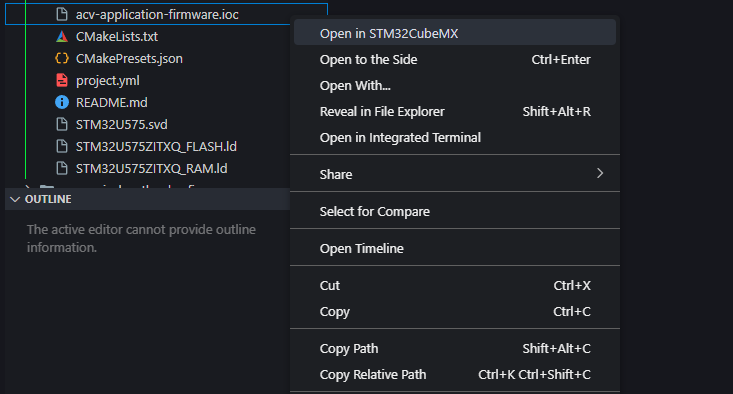

# STM32CubeMX File Opener

The **STM32CubeMX File Opener** extension for Visual Studio Code lets you easily open `.ioc` files (STM32CubeMX project files) directly in STM32CubeMX from within VS Code. This extension automatically detects the STM32CubeMX installation path on your system, but also gives you the option to manually set the path if necessary.

## Features

- **Quick Access**: Simply right-click on a `.ioc` file in the Explorer and select "Open in STM32CubeMX." It’s that easy.
- **Automatic Detection**: The extension tries to detect the STM32CubeMX installation automatically (e.g., `C:\Program Files\STMicroelectronics\STM32Cube\STM32CubeMX\STM32CubeMX.exe` on Windows).
- **Custom Path Option**: If STM32CubeMX is installed somewhere else or the automatic detection doesn’t work, you can easily set the path manually through the extension’s settings.

### Screenshot

## Requirements

- You need to have **STM32CubeMX** installed on your computer.
  - By default, the extension looks for STM32CubeMX in common installation locations, but you can set a custom path if it's installed elsewhere.

## Extension Settings

This extension contributes the following setting:

- `stm32cubemx.path`: Path to the STM32CubeMX executable. This setting allows you to specify a custom path if the automatic detection doesn’t find STM32CubeMX on your system.

### How to Set the STM32CubeMX Path:

1. Open VS Code and press `Ctrl+Shift+P` (`Cmd+Shift+P` on macOS) to open the Command Palette.
2. Type "Preferences: Open Settings (UI)" and press Enter.
3. In the Settings search bar, type "STM32CubeMX Path."
4. Enter the full path to your `STM32CubeMX.exe` file if the extension hasn’t automatically found it. For example: `C:\Program Files\STMicroelectronics\STM32Cube\STM32CubeMX\STM32CubeMX.exe`.

## Known Issues

- **Non-standard installations**: If STM32CubeMX is installed in an unusual location, you may need to manually configure the path using the settings.
- **Cross-platform support**: Currently, automatic path detection works best on Windows. For macOS or Linux, you may need to manually set the executable path.

## Release Notes

### 1.0.0

- Initial release of STM32CubeMX File Opener.
- Added right-click context menu to open `.ioc` files with STM32CubeMX.
- Automatic path detection for Windows.
- Option to manually configure the path to STM32CubeMX.

---

## Contributing to Best Practices

We recommend following [VS Code's Extension Guidelines](https://code.visualstudio.com/api/references/extension-guidelines) to ensure your extension complies with best practices.

## Working with Markdown

If you're working on the README in VS Code, here are a few handy shortcuts:

- Split the editor (`Cmd+\` on macOS or `Ctrl+\` on Windows and Linux).
- Toggle preview (`Shift+Cmd+V` on macOS or `Shift+Ctrl+V` on Windows and Linux).
- Use `Ctrl+Space` to trigger markdown suggestions.

## More Resources

- [Visual Studio Code's Markdown Support](http://code.visualstudio.com/docs/languages/markdown)
- [Markdown Syntax Reference](https://help.github.com/articles/markdown-basics/)

---

**Enjoy using STM32CubeMX File Opener!**
