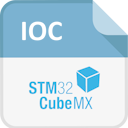

# STM32CubeMX File Opener

The **STM32CubeMX File Opener** extension for Visual Studio Code lets you easily open `.ioc` files (STM32CubeMX project files) directly in STM32CubeMX from within VS Code. This extension automatically detects the STM32CubeMX installation path on your system but also gives you the option to manually set the path if necessary.

## Features

- **Quick Access**: Right-click on a `.ioc` file in the Explorer and select "Open in STM32CubeMX." It’s that easy.
- **Automatic Detection**: The extension tries to detect the STM32CubeMX installation automatically:
  - On **Windows**: `C:\Program Files\STMicroelectronics\STM32Cube\STM32CubeMX\STM32CubeMX.exe`
  - On **macOS**: `/Applications/STMicroelectronics/STM32CubeMX.app/Contents/MacOS/STM32CubeMX`
  - On **Linux**: `$HOME/STM32CubeMX/STM32CubeMX`
- **Custom Path Option**: If STM32CubeMX is installed elsewhere, or the automatic detection doesn’t work, you can easily set the path manually through the extension’s settings.
- **Direct Access to Settings**: If the STM32CubeMX path is not found, the error message provides a clickable option to open the extension settings directly for easy configuration.

### Screenshot

## Requirements

- **STM32CubeMX** must be installed on your computer.
  - By default, the extension looks for STM32CubeMX in common installation locations (detailed above), but you can set a custom path if it's installed elsewhere.

## Extension Settings

This extension contributes the following setting:

- `stm32cubemx.path`: Path to the STM32CubeMX executable. This setting allows you to specify a custom path if the automatic detection doesn’t find STM32CubeMX on your system.

### How to Set the STM32CubeMX Path:

1. Open VS Code and press `Ctrl+Shift+P` (`Cmd+Shift+P` on macOS) to open the Command Palette.
2. Type "Preferences: Open Settings (UI)" and press Enter.
3. In the Settings search bar, type "STM32CubeMX Path."
4. Enter the full path to your `STM32CubeMX.exe` file if the extension hasn’t automatically found it. For example:
   - On **Windows**: `C:\Program Files\STMicroelectronics\STM32Cube\STM32CubeMX\STM32CubeMX.exe`
   - On **macOS**: `/Applications/STMicroelectronics/STM32CubeMX.app/Contents/MacOS/STM32CubeMX`
   - On **Linux**: `/home/$USER/STM32CubeMX/STM32CubeMX`

## Release Notes

### 0.0.1

- Initial release of STM32CubeMX File Opener.
- Added right-click context menu to open `.ioc` files with STM32CubeMX.
- Automatic path detection for Windows, macOS, and Linux.
- Option to manually configure the path to STM32CubeMX.

### 0.1.0

- Fixed automatic path detection for macOS and Linux.
- Added a clickable error message to directly open extension settings when STM32CubeMX path is not found.
- Added extension logo.

